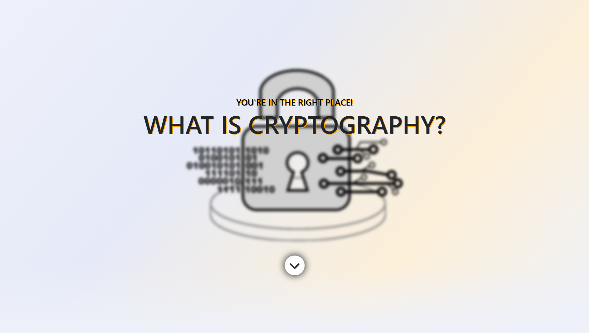
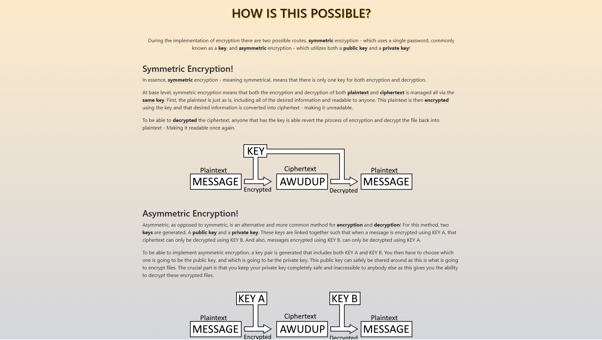
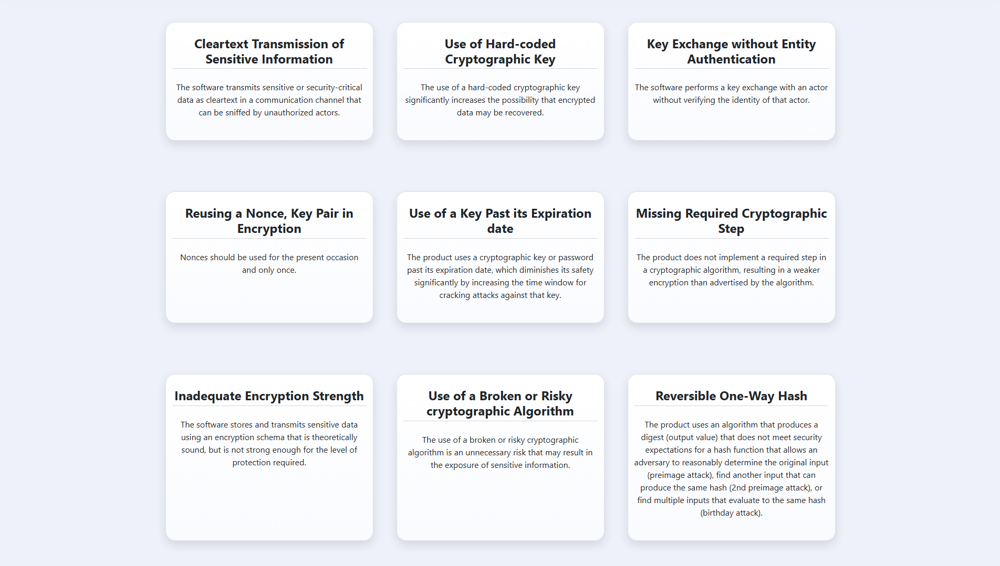

# Cryptographic Failure Education Tool 2023


*Figure 1: The application's welcoming splash screen, which introduces the user to the foundational question: "What is Cryptography?"*

An interactive, responsive single-page web application designed to educate developers, students, and security enthusiasts on foundational cryptography concepts, common cryptographic failures, and corresponding mitigation strategies.

## Table of Contents
- [Features](#features)
- [Technologies Used](#technologies-used)
- [Getting Started](#getting-started)
- [License](#license)

## Features

- **Interactive Cryptography Overview**: Visual guide comparing **Symmetric** (single key) vs. **Asymmetric** (public/private key pair) encryption with simple, clean flow diagrams.
- **Interactive Visualizers**: Includes interactive folder elements where you can hover to reveal plaintext contents turning into ciphertext.
- **Vulnerability Catalog**: A comprehensive collection of cryptographic weaknesses and vulnerabilities based on common real-world CVEs and CWEs.

### Visual Previews

Below are screenshots showing the application's key educational interfaces:


*Figure 2: The conceptual diagrams section illustrating the flow of plaintext to ciphertext under Symmetric (single shared key) vs. Asymmetric (public/private key pair) encryption schemes.*


*Figure 3: The Vulnerability Catalog view, featuring an interactive grid of common cryptographic failures based on real-world CVEs and CWEs.*
  
## Technologies Used

- **HTML5** 
- **CSS3** 
- **Vanilla JavaScript**
- **Bootstrap 5**
- **jQuery**
- **Font Awesome**

## Getting Started

Since this is a client-side static web application, there are no database or backend servers to configure. 

1. Clone this repository to your local machine:
   ```bash
   git clone https://github.com/yourusername/cryptographic-failure.git
   ```
2. Double-click `index.html` to open the website directly in any modern browser (Chrome, Firefox, Safari, Edge).

## License

This project is licensed under the MIT License - see the [LICENSE](LICENSE) file for details.
